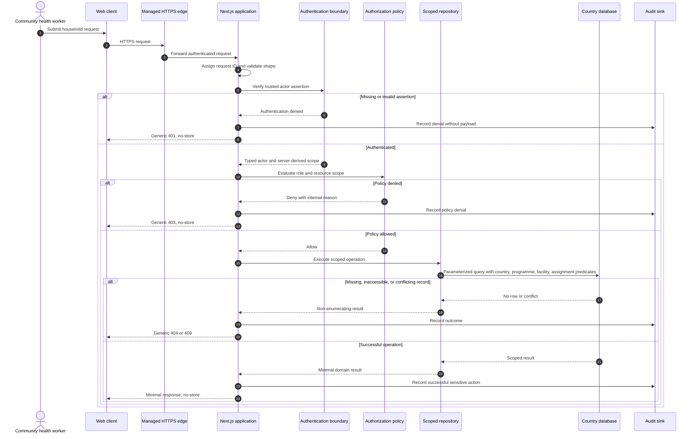

# Application Security Flow

## Security properties

- The client does not select its authoritative country or authorization scope.
- Authentication produces a typed actor context before business logic runs.
- Authorization is evaluated before repository access.
- Repository queries repeat the country and assignment restrictions.
- Missing and inaccessible resources are intentionally difficult to distinguish.
- Audit events contain identifiers and outcomes, not Restricted payloads.
- Sensitive responses are not cached.
- Unexpected failures are translated to stable generic responses.

## Current limitation

The repository currently uses `x-afyabridge-actor` as a local integration seam. Production deployment must replace it with an integrity-protected assertion issued by a trusted authentication component and must strip client-supplied identity headers at the edge.
