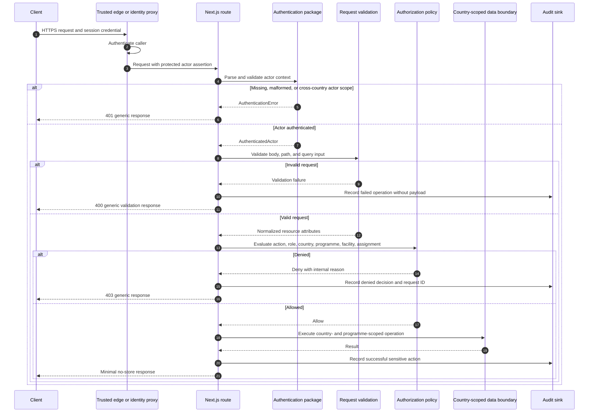

# Authorization Flow

## Security properties

- The client cannot establish its own trusted actor context.
- Authentication precedes authorization.
- Validation precedes the protected operation.
- Role permissions and resource attributes are evaluated together.
- Country and programme checks occur before data access.
- Audit events correlate the actor, request, action, outcome, and resource without recording Restricted payloads.
- Failure responses do not disclose internal policy reasons.
