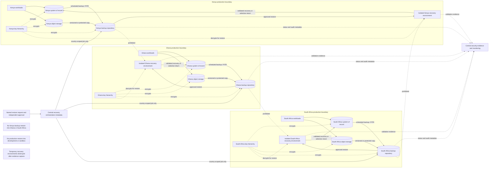

# Backup and Recovery Flow

## Status

**Designed**

## Flow notes

1. Primary data, object storage, backup repositories, recovery environments, and encryption keys remain country-scoped.
2. Central orchestration receives job metadata and invokes only approved country-specific identities; it does not receive unrestricted backup contents.
3. Restore execution requires a named request, independent approval, a defined target, and a validation plan.
4. Side-by-side recovery into an isolated temporary environment is preferred for investigation and integrity checks.
5. Restored data is returned to production only after technical and business validation.
6. Completed deletion jobs must be replayed or reconciled before an older backup returns to service.
7. Temporary recovery environments and elevated permissions are removed after evidence capture.
8. Cross-country and production-to-nonproduction restores are prohibited unless a separately approved exception exists.

## Required evidence

- backup coverage report;
- successful backup records;
- restore authorization record;
- recovery-environment configuration;
- key and secret dependency validation;
- integrity and application test results;
- measured RPO and RTO;
- deletion-replay confirmation;
- temporary-resource destruction evidence;
- unresolved recovery exceptions.
