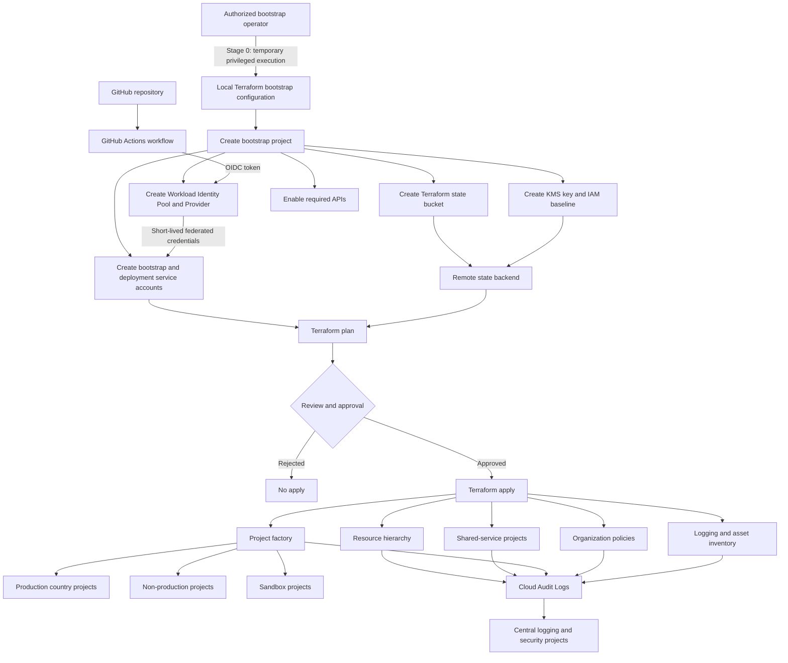
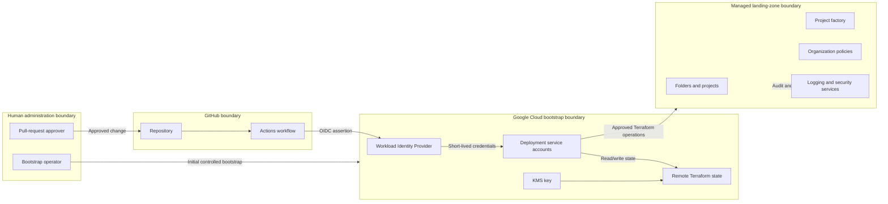
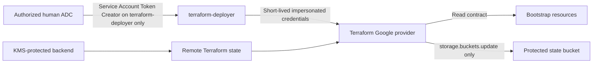

# Terraform Bootstrap Flow

## Purpose

This diagram shows how the minimal bootstrap process establishes the remote Terraform backend, deployment identities, the intended GitHub Workload Identity Federation path, and the later project-factory execution path.

## Bootstrap flow

## Trust boundaries

## Live bootstrap validation path

The first live validation exercised the Google Cloud bootstrap boundary before enabling the full GitHub federation path:

This validation proved the service-account impersonation and steady-state Google Cloud IAM model without using a downloaded service-account key. It did **not** validate GitHub OIDC token exchange or protected-environment enforcement.

## Execution stages

### Stage 0 — Minimal bootstrap

A temporary authorized operator creates only the resources required to move subsequent changes into the controlled delivery path:

- bootstrap project;
- state bucket;
- encryption and access controls;
- required APIs;
- Workload Identity Federation configuration;
- deployment identities.

Stage 0 does not create workload projects or application infrastructure.

The v0.7H live exercise validated the currently implemented bootstrap Terraform resources, remote state, KMS protection, service-account impersonation, and least-privilege execution-role model. Federation remains a separately pending live-validation step.

### Stage 1 — Foundation deployment

GitHub Actions assumes short-lived Google Cloud credentials and deploys:

- folders;
- shared-service projects;
- baseline organization policies;
- centralized logging;
- asset inventory;
- project-factory prerequisites.

### Stage 2 — Managed project creation

The project factory creates production, non-production, and sandbox projects from version-controlled requests.

### Stage 3 — Workload deployment

Later phases deploy application, data, networking, and security controls into approved projects using separate state and deployment identities.

## Security controls

The flow enforces or is designed to enforce:

- no long-lived Google Cloud credential in GitHub;
- no service-account JSON key for the validated bootstrap execution path;
- no local production Terraform state after backend migration;
- review before apply;
- separate state and identities by scope;
- remote state encryption and versioning;
- auditable changes;
- controlled project creation;
- centralized logging of administrative actions;
- a measured steady-state bootstrap read contract; and
- a bucket-scoped metadata update permission separated from the read contract.

## Failure handling

| Failure | Required response |
|---|---|
| OIDC authentication failure | Stop workflow; inspect provider conditions and GitHub claims |
| State lock or concurrency conflict | Stop apply; resolve through the documented recovery process |
| Stale plan | Regenerate plan from current branch and state |
| Unauthorized resource request | Fail policy or project-factory validation |
| Partial apply | Review Terraform state and cloud audit logs before retrying |
| Suspected credential compromise | Disable federation binding or deployment identity and investigate |
| State corruption or deletion | Recover from bucket version history using the documented state-recovery procedure |

## Related documents

- [`../landing-zone/bootstrap-and-state.md`](../landing-zone/bootstrap-and-state.md)
- [`../landing-zone/project-factory.md`](../landing-zone/project-factory.md)
- [`../landing-zone/organization-policies.md`](../landing-zone/organization-policies.md)
- [`../landing-zone/logging-and-asset-inventory.md`](../landing-zone/logging-and-asset-inventory.md)
- [`../../adr/ADR-003-terraform-state-and-bootstrap.md`](../../adr/ADR-003-terraform-state-and-bootstrap.md)
- [`../../evidence/v0.7h-bootstrap-live-validation.md`](../../evidence/v0.7h-bootstrap-live-validation.md)

## Implementation status

**Partially live-validated** — the protected Terraform bootstrap control plane and scoped service-account impersonation path have been exercised in a dedicated Google Cloud lab project. GitHub Workload Identity Federation and the Stage 1–3 deployment path remain pending live validation.
