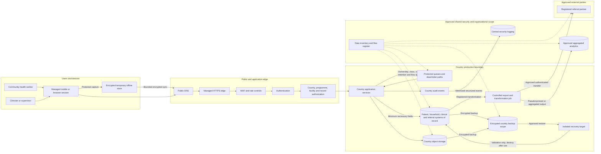

# Data Protection Flow

## Status

**Designed**

## Purpose

This diagram shows the primary data-protection boundaries from field capture through country systems of record, controlled integrations, analytics, security logging, backup, and deletion.

## Trust and control boundaries

1. **User and device boundary** — local data is temporary, encrypted, attributable, and removed after sync or expiry.
2. **Public edge boundary** — transport protection and filtering occur before workload invocation, but application authorization remains mandatory.
3. **Country production boundary** — Restricted country data is stored, processed, backed up, and restored within the matching country scope by default.
4. **Shared security boundary** — centrally governed logs contain minimized security metadata rather than full clinical payloads.
5. **Analytics boundary** — only approved transformed outputs enter analytics; raw Restricted production data does not become a shared lake by default.
6. **Partner boundary** — transfers require a registered flow, minimum fields, destination authentication, bounded retries, retention, and monitoring.
7. **Recovery boundary** — restored copies are isolated, temporary, access-controlled, and destroyed after recovery validation.

## Required enforcement points

| Enforcement point | Required decision |
|---|---|
| Device capture | Is the user, device, country, assignment, and offline retention state valid? |
| Edge | Is the request protected, expected, and allowed to reach the origin? |
| Authentication | Is the identity valid and sufficiently authenticated? |
| Authorization | Does the role and assignment permit this country, programme, facility, action, and record? |
| Country service | Is the schema valid and is the destination the correct country system of record? |
| Queue and retry | Are payload, expiry, retry, dead-letter access, and replay controls valid? |
| Export transformation | Is the purpose approved and are fields minimized or transformed as required? |
| Partner transfer | Is the partner, destination, authentication, retention, and contract still approved? |
| Analytics | Has re-identification and small-group disclosure risk been assessed? |
| Backup | Are country, key, retention, immutability, and recovery requirements satisfied? |
| Restore | Is the restore approved, isolated, monitored, and scheduled for destruction? |
| Logging | Are attribution fields present while secrets and unnecessary health data are excluded? |

## Prohibited paths

The design intentionally excludes:

- production data flowing into development or sandbox;
- unrestricted cross-country replication;
- public database, object-store, backup, or administrative access;
- direct device-to-database connections;
- unregistered partner destinations;
- raw Restricted data entering shared analytics by default;
- full patient or clinical payloads entering central logs;
- permanent retention of offline caches, failed messages, temporary exports, or restored recovery copies.

## Validation scenarios

Implementation tests should demonstrate that:

- a Kenya user cannot sync a record into the Ghana or South Africa production store;
- a non-production identity cannot read or restore a production backup;
- an unregistered export destination is denied;
- a partner replay or expired webhook is rejected;
- logs omit tokens, secrets, and prohibited patient fields;
- offline data expires or is revoked after device or account compromise;
- a restored dataset is isolated and deleted after recovery validation;
- aggregated output below approved disclosure thresholds is blocked or reviewed.
