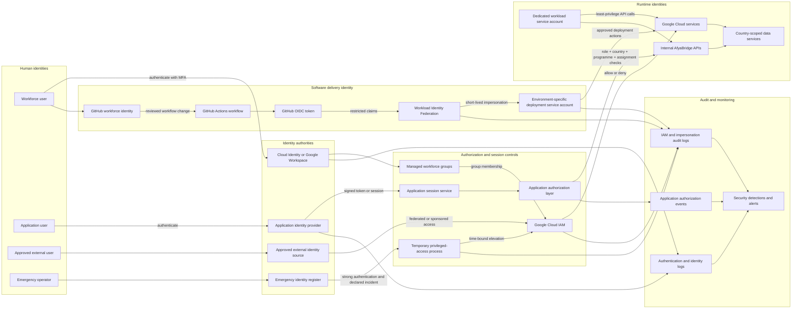

# Identity Flow

## Purpose

This diagram shows the primary authentication and authorization flows for workforce users, application users, workloads, CI/CD pipelines, external integrations, and emergency operators.

## Control interpretation

### Workforce flow

1. A workforce user authenticates through the organizational directory using MFA.
2. Managed group membership determines eligible cloud roles.
3. Google Cloud IAM evaluates inherited and resource-level policy.
4. Authentication, group changes, and IAM decisions produce audit data.

### CI/CD flow

1. A reviewed GitHub Actions workflow receives an OIDC token.
2. Workload Identity Federation validates repository, branch, workflow, and environment claims.
3. The workflow impersonates a dedicated, environment-specific deployment service account.
4. Credentials are short-lived and no service-account key is stored in GitHub.

### Application-user flow

1. A CHW, supervisor, facility worker, or programme administrator authenticates through the application identity provider.
2. The backend validates the token and session state.
3. The authorization layer evaluates role, country, programme, geographic assignment, and requested action.
4. Data services receive requests only after server-side authorization succeeds.

### Workload flow

Each deployable service runs as a dedicated service account. Its cloud and internal API access is limited to the exact services, projects, countries, and operations required by the workload.

### Emergency flow

Emergency identities remain isolated from routine administration. Use requires a declared incident or approved recovery activity, strong authentication, temporary elevation, immediate alerting, and post-use review.

## Deny conditions

Access must be denied when:

- the identity is disabled or expired;
- required MFA or authentication assurance is absent;
- the user lacks the required managed-group membership;
- the requested environment or country is outside the approved scope;
- an application token has invalid issuer, audience, signature, expiry, or session state;
- application role or assignment checks fail;
- OIDC claims do not match the approved repository, workflow, branch, or environment;
- a workload attempts an operation outside its service-account permissions;
- emergency elevation lacks the required incident or approval record.

## Related documents

- [`../identity/README.md`](../identity/README.md)
- [`../identity/identity-domains.md`](../identity/identity-domains.md)
- [`../identity/workforce-access.md`](../identity/workforce-access.md)
- [`../landing-zone/bootstrap-and-state.md`](../landing-zone/bootstrap-and-state.md)
- [`../../threat-model/trust-boundaries.md`](../../threat-model/trust-boundaries.md)