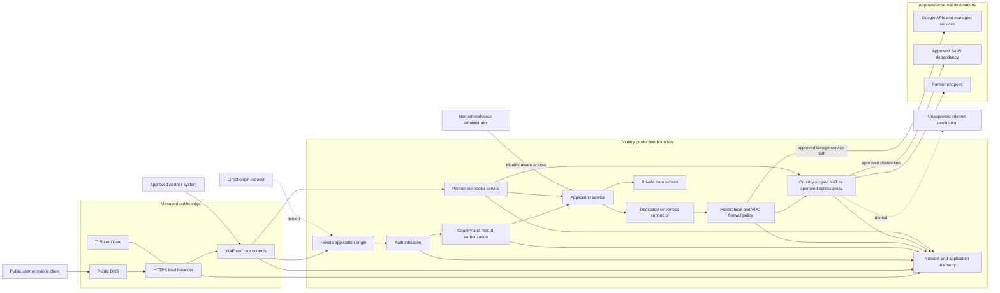

# Ingress and Egress Flow

## Purpose

This diagram shows the approved public ingress path, private service path, and controlled outbound path for a country production environment. It emphasizes that the managed edge, application authorization, workload identity, network policy, and country data boundary all participate in access decisions.

## Trust boundaries

1. **Public client to managed edge** — traffic is untrusted until protocol, WAF, rate, and application controls evaluate it.
2. **Managed edge to origin** — only approved edge paths may invoke the origin; direct-origin requests fail closed.
3. **Origin to application authorization** — successful transport does not grant country, programme, facility, or record access.
4. **Application to private data service** — workload identity, private reachability, and data authorization all apply.
5. **Workload to egress control plane** — outbound access is restricted by source, destination, protocol, country, and environment.
6. **AfyaBridge to partner** — per-partner authentication, payload controls, and source attribution are required.

## Required denial paths

The implemented architecture must prove that:

- a client cannot bypass the managed edge and invoke the origin directly;
- an unauthenticated or unauthorized request cannot reach protected operations;
- a workload cannot use another country's network as an egress path;
- a production service cannot reach arbitrary internet destinations;
- a partner cannot access unrelated application paths or country environments;
- administrative access cannot use a public management port;
- edge or network logs do not capture prohibited health information, tokens, or secrets.

## Observability

Correlation identifiers should connect:

- edge request logs;
- WAF actions;
- authentication and authorization decisions;
- workload invocation logs;
- firewall decisions;
- NAT or proxy activity;
- partner connector events;
- data-service audit records.

## Status

**Designed.** The diagram communicates control intent and does not claim that any depicted resource or denial path has been deployed or tested.
