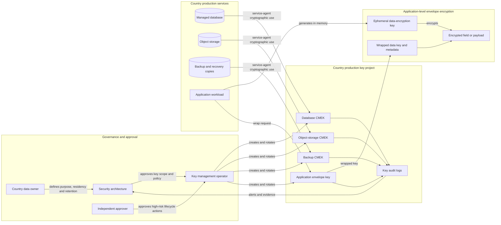
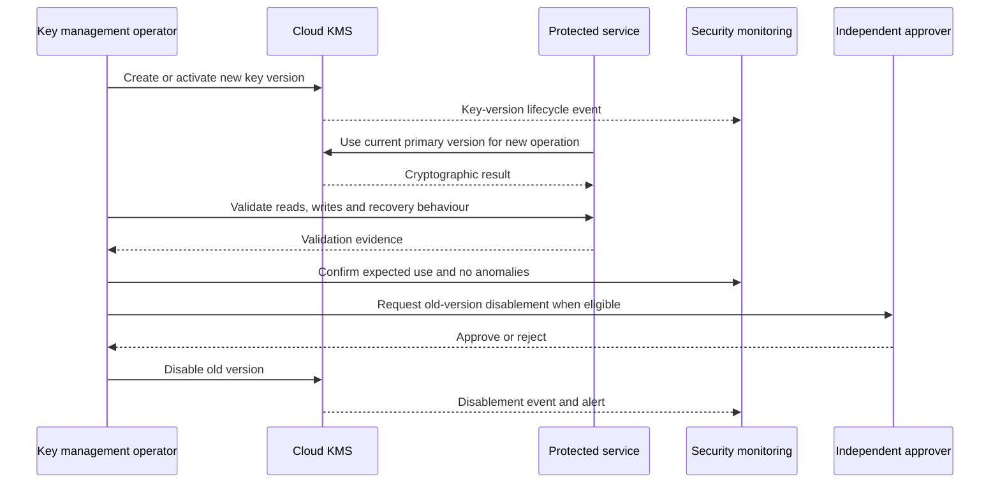
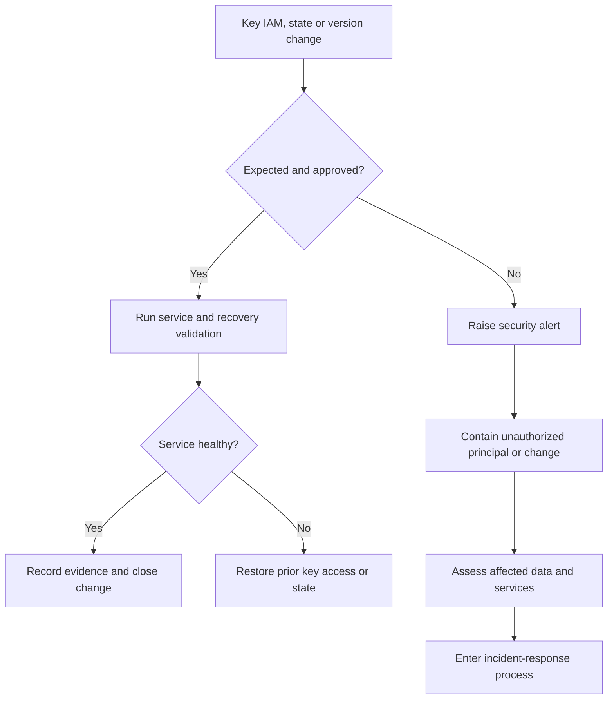

# Key Management Flow

## Purpose

This diagram shows how country-scoped Cloud KMS keys protect managed resources and selected application-level encrypted data without granting routine human decrypt access.

## Managed-service flow

1. A country production resource is created with an approved country- and purpose-scoped CMEK.
2. The managed service agent receives cryptographic use on the exact key required by the resource.
3. Application users and ordinary administrators do not receive key-administration or direct decrypt permissions.
4. Cloud KMS records key lifecycle and cryptographic activity.
5. Security monitoring reconciles key users, protected resources, and expected country scope.

## Envelope-encryption flow

1. The application creates a data-encryption key in memory.
2. The data-encryption key encrypts the selected field or payload.
3. Cloud KMS wraps the data-encryption key with the application key-encryption key.
4. The application stores ciphertext, wrapped key material, algorithm metadata, and key reference.
5. Plaintext data keys are discarded after the operation.
6. Decryption requires both access to the ciphertext and authorized use of the wrapping key.

## Rotation flow

Rotation creates a new primary version but does not, by itself, prove that historical data has been re-encrypted. Service-specific verification remains required.

## Failure paths

## Trust boundaries

- country data owner to central security governance;
- key operator to Cloud KMS control plane;
- managed-service agent to country key;
- application runtime to application key-encryption key;
- ciphertext storage to key project;
- production country key project to other countries and non-production;
- key audit logs to central monitoring.

## Required tests

- approved country service can use its key;
- another country service cannot use the key;
- non-production identities cannot use production keys;
- routine human users cannot decrypt or administer keys;
- new writes use the current primary version;
- older ciphertext remains readable while required versions are enabled;
- planned disablement produces expected failure and rollback behaviour;
- backup restore succeeds with required historical key versions;
- unexpected IAM or lifecycle changes generate alerts;
- envelope-encryption metadata supports successful decrypt and future format versioning.

## Status

This diagram represents the **Designed** key-management flow. It does not assert that Cloud KMS resources, IAM bindings, rotation schedules, envelope encryption, alerts, or recovery tests have been implemented.
