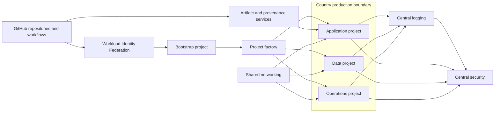
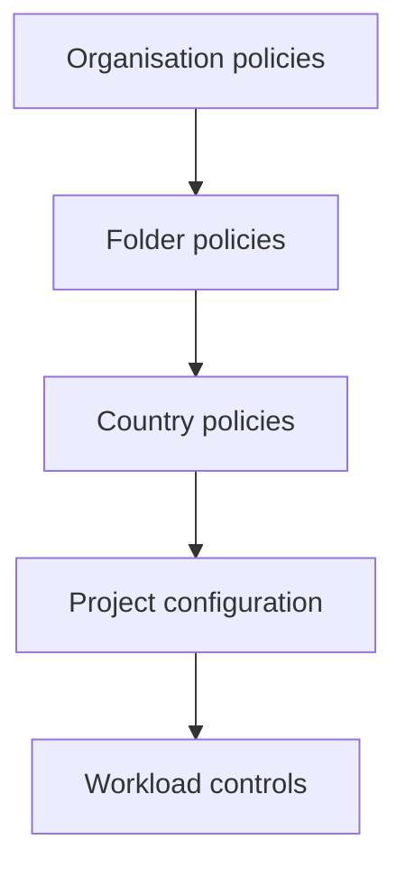

# Google Cloud Landing-Zone Diagram

## Resource hierarchy

```mermaid
flowchart TB
    ORG[Google Cloud Organization]

    ORG --> BOOT[fld-bootstrap]
    ORG --> COMMON[fld-common]
    ORG --> PROD[fld-production]
    ORG --> NONPROD[fld-nonproduction]
    ORG --> SANDBOX[fld-sandbox]

    BOOT --> BOOTCORE[prj-bootstrap-core]

    COMMON --> SEC[prj-common-security]
    COMMON --> LOG[prj-common-logging]
    COMMON --> NET[prj-common-networking]
    COMMON --> CICD[prj-common-cicd]
    COMMON --> ART[prj-common-artifacts]
    COMMON --> DNS[prj-common-dns]

    PROD --> KE[fld-prd-kenya]
    PROD --> GH[fld-prd-ghana]
    PROD --> ZA[fld-prd-south-africa]

    KE --> KEAPP[prj-prd-ke-app]
    KE --> KEDATA[prj-prd-ke-data]
    KE --> KEOPS[prj-prd-ke-ops]

    GH --> GHAPP[prj-prd-gh-app]
    GH --> GHDATA[prj-prd-gh-data]
    GH --> GHOPS[prj-prd-gh-ops]

    ZA --> ZAAPP[prj-prd-za-app]
    ZA --> ZADATA[prj-prd-za-data]
    ZA --> ZAOPS[prj-prd-za-ops]

    NONPROD --> DEV[prj-nonprd-development]
    NONPROD --> STGAPP[prj-nonprd-staging-app]
    NONPROD --> STGDATA[prj-nonprd-staging-data]
    NONPROD --> NPOPS[prj-nonprd-operations]

    SANDBOX --> SBX[prj-sbx-expiring]
```

## Control-plane relationships

The arrows represent approved management, delivery, network, logging, or security relationships. They do not imply unrestricted IAM access or unrestricted data flow.

## Policy inheritance

Policy is applied at the highest appropriate scope and inherited downward. Project-level exceptions require explicit approval, compensating controls, an owner, and an expiry date.

## Boundary notes

### Bootstrap boundary

The bootstrap project contains Terraform state and deployment prerequisites. It does not host application workloads or operational data.

### Common-services boundary

Common projects provide shared control-plane services. Central security and logging access does not automatically grant direct access to country operational databases.

### Country production boundary

Each country has separate application, data, and operations projects beneath a dedicated folder. Country-level IAM and policy are scoped at the country folder or below.

### Non-production boundary

Development and staging use separate identities, state, secrets, and data. They cannot connect to production data services.

### Sandbox boundary

Sandbox resources are short-lived, synthetic-data-only, quota-constrained, and isolated from production.

## Related documents

- [`../landing-zone/README.md`](../landing-zone/README.md)
- [`../landing-zone/resource-hierarchy.md`](../landing-zone/resource-hierarchy.md)
- [`../../threat-model/trust-boundaries.md`](../../threat-model/trust-boundaries.md)
- [`../../security-objectives.md`](../../security-objectives.md)

## Status

**Designed.** The diagram shows the target hierarchy and relationships. It does not represent deployed Google Cloud resources.
