# Network Topology Diagram

## Status

**Designed**

## Purpose

This diagram shows the intended AfyaBridge network boundaries and primary traffic paths. It is a logical architecture view, not a deployed inventory.

```mermaid
flowchart TB
    Internet[Internet users and external clients]
    Partners[Approved partners and vendors]
    Admins[Privileged operators]

    subgraph Edge[Managed public edge]
        DNS[Public DNS]
        LB[External HTTPS load balancer]
        WAF[Edge security policy and WAF]
    end

    Internet --> DNS --> LB --> WAF
    Partners --> WAF

    subgraph KE[Kenya production Shared VPC]
        KEAPP[Application subnet and services]
        KEDATA[Private data services]
        KEOPS[Operations subnet]
        KEEGRESS[Controlled egress]
        KEAPP --> KEDATA
        KEOPS --> KEAPP
        KEAPP --> KEEGRESS
    end

    subgraph GH[Ghana production Shared VPC]
        GHAPP[Application subnet and services]
        GHDATA[Private data services]
        GHOPS[Operations subnet]
        GHEGRESS[Controlled egress]
        GHAPP --> GHDATA
        GHOPS --> GHAPP
        GHAPP --> GHEGRESS
    end

    subgraph ZA[South Africa production Shared VPC]
        ZAAPP[Application subnet and services]
        ZADATA[Private data services]
        ZAOPS[Operations subnet]
        ZAEGRESS[Controlled egress]
        ZAAPP --> ZADATA
        ZAOPS --> ZAAPP
        ZAAPP --> ZAEGRESS
    end

    subgraph STG[Shared staging VPC]
        STGAPP[Staging services]
        STGDATA[Staging data]
        STGAPP --> STGDATA
    end

    subgraph DEV[Shared development VPC]
        DEVAPP[Development services]
        DEVDATA[Development data]
        DEVAPP --> DEVDATA
    end

    subgraph Shared[Shared control-plane services]
        SEC[Security and detection]
        LOG[Central logging]
        CICD[CI/CD and deployment]
        ART[Artifact registry]
        DNSINT[Private DNS management]
    end

    WAF -->|approved origins only| KEAPP
    WAF -->|approved origins only| GHAPP
    WAF -->|approved origins only| ZAAPP
    WAF -->|non-production hostnames| STGAPP

    KEAPP -. telemetry .-> LOG
    GHAPP -. telemetry .-> LOG
    ZAAPP -. telemetry .-> LOG
    STGAPP -. telemetry .-> LOG
    DEVAPP -. telemetry .-> LOG
    LOG --> SEC

    CICD -->|scoped deployment calls| KEAPP
    CICD -->|scoped deployment calls| GHAPP
    CICD -->|scoped deployment calls| ZAAPP
    CICD -->|scoped deployment calls| STGAPP
    CICD -->|scoped deployment calls| DEVAPP
    ART -->|authenticated artifact retrieval| KEAPP
    ART -->|authenticated artifact retrieval| GHAPP
    ART -->|authenticated artifact retrieval| ZAAPP

    Admins -->|identity-aware temporary access| KEOPS
    Admins -->|identity-aware temporary access| GHOPS
    Admins -->|identity-aware temporary access| ZAOPS

    KEEGRESS --> Internet
    GHEGRESS --> Internet
    ZAEGRESS --> Internet

    KE -. no direct route .- GH
    GH -. no direct route .- ZA
    KE -. no direct route .- ZA
    STG -. no route to production .- KE
    STG -. no route to production .- GH
    STG -. no route to production .- ZA
    DEV -. no route to production .- KE
    DEV -. no route to production .- GH
    DEV -. no route to production .- ZA
```

## Trust boundaries

1. **Internet to managed edge** — all public traffic is untrusted until edge and application controls succeed.
2. **Managed edge to workload origin** — only approved origins and protocols are permitted.
3. **Application to data zone** — private connectivity still requires service identity and authorization.
4. **Country production boundaries** — no direct routing exists between production countries.
5. **Production to non-production** — no non-production route or identity implies production access.
6. **Workloads to shared services** — narrow telemetry, artifact, DNS, and deployment interfaces only.
7. **Administration to operations zone** — temporary identity-aware access; no public management ports.
8. **Workload to internet** — controlled and attributable egress only.

## Prohibited paths

The diagram intentionally omits and prohibits:

- direct country-to-country production routing;
- non-production connectivity to production data services;
- direct public access to application or data subnets;
- shared-service transit between country networks;
- public SSH, RDP, or database administration;
- unrestricted workload egress.

## Validation notes

The implemented topology must be validated with route inspection, firewall-policy tests, public-exposure checks, private-service connectivity tests, denied cross-boundary probes, and centralized log evidence.
