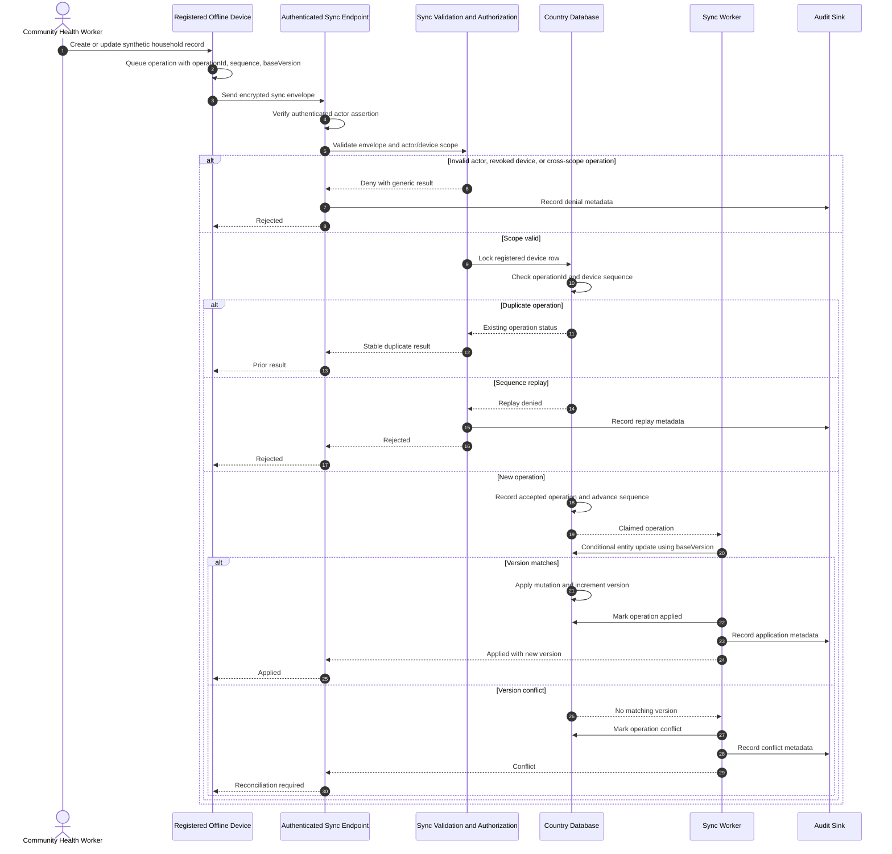

# Offline Synchronization Security Flow

## Trust boundaries

1. Offline device storage is outside the cloud trust boundary and requires local encryption and user/device binding.
2. The sync endpoint accepts identity only from the trusted authentication component.
3. Envelope scope is untrusted until matched against the actor and registered device.
4. Database uniqueness and row locking provide the authoritative replay boundary.
5. Entity mutation must repeat country and programme predicates and use optimistic concurrency.
6. Audit events contain operation metadata, never Restricted payload content.

## Current implementation boundary

Operation validation, device binding, replay storage, idempotency keys, and controlled conflict handling are implemented. Entity-specific mutation is intentionally fail-closed and remains pending; the worker records a conflict instead of applying an unsafe write.
