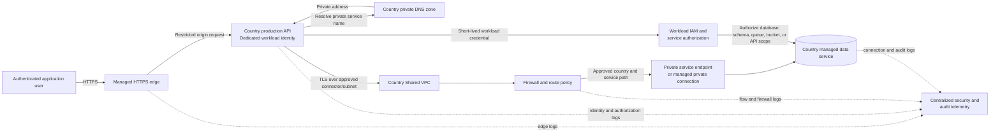
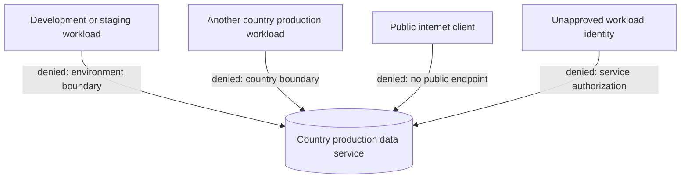
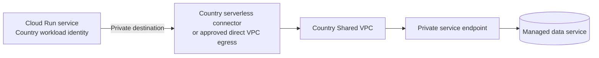

# Private Service Access Flow

## Purpose

This diagram shows how a country production workload reaches a managed private service while preserving environment, country, identity, and data boundaries.

## Required controls

The flow succeeds only when:

1. The request enters through the approved public edge.
2. The application workload uses its dedicated country and environment identity.
3. The service name resolves through the intended private DNS zone.
4. Routing remains inside the country production boundary.
5. Firewall policy allows the exact source and destination relationship.
6. The managed service has no required public path.
7. The destination validates the workload credential.
8. Service-level authorization permits the requested operation.
9. Logs correlate user, edge, workload, network, and data-service activity.

## Denied paths

## Serverless variation

For Cloud Run or another managed serverless runtime, the application reaches the country Shared VPC through a country- and environment-specific connector or approved direct VPC egress capability.

The connector provides reachability only. IAM, TLS, database authorization, country scope, and logging remain mandatory.

## Isolation properties

- Kenya, Ghana, and South Africa use separate production networks and private-service allocations.
- Development and staging cannot route to production private services.
- Shared security services receive telemetry but do not gain reverse data-plane access.
- A private connection does not create transitive country-to-country routing.
- Public endpoint fallback is not an accepted recovery mechanism.

## Validation evidence

Later implementation evidence should include:

- Terraform plans for reserved ranges, connections, DNS, connector, and firewall policy;
- successful approved connection test;
- failed cross-environment and cross-country tests;
- failed unauthenticated or unauthorized service test;
- confirmation that public access is disabled;
- flow, IAM, DNS, and managed-service audit logs;
- drift detection for route, endpoint, connector, and DNS changes.

## Status

**Designed.** The diagram represents the intended architecture and not a deployed network.