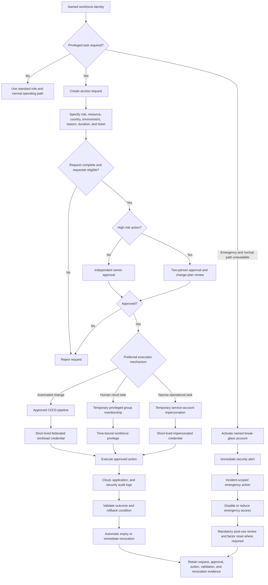

# Privileged Access Flow

## Purpose

This diagram shows the standard temporary-elevation path, service-account impersonation path, and emergency break-glass path for privileged access.

## Standard path

The normal privileged-access sequence is:

1. A named person identifies a task that cannot be completed with standard access.
2. The person submits a scoped and expiring request.
3. An independent owner approves the request.
4. High-risk actions receive stronger review.
5. Access is provided through automation, temporary group membership, or impersonation.
6. The action is logged and validated.
7. Access expires or is revoked.
8. Evidence is retained.

## Trust boundaries

The flow crosses the following trust boundaries:

| Boundary | Security concern |
|---|---|
| Workforce identity to access-governance process | Identity assurance, MFA, requester attribution |
| Request process to approval authority | Self-approval, weak justification, excessive duration |
| Approval process to Google Groups or IAM | Unauthorized grant, scope mismatch, non-expiring access |
| Human identity to service-account impersonation | Token misuse, privilege chaining, broad impersonation |
| CI/CD platform to Google Cloud federation | Repository, branch, environment, audience, and subject trust |
| Privileged principal to production resource | Country and environment isolation, destructive actions |
| Production resource to centralized logging | Logging bypass, incomplete attribution, sensitive log content |
| Break-glass custody to emergency account | Shared recovery material, unobserved activation, routine use |

## Required controls

- Named identities only
- Strong MFA
- Eligibility checks
- Independent approval
- Two-person approval for high-risk changes
- Explicit country and environment scope
- Short-lived credentials
- Automatic expiry
- No service-account keys
- Alerting on break-glass use
- Central audit logging
- Post-change validation
- Post-use review for emergency access

## Failure paths

The design must safely handle:

- incomplete requests;
- ineligible requesters;
- rejected approval;
- expired approval before execution;
- access granted with the wrong country or environment scope;
- failed group-membership update;
- failed impersonation;
- expired or stale CI/CD token;
- action failure requiring rollback;
- logging failure;
- access that remains active after expiry;
- break-glass activation without an incident record.

## Related documents

- [`../identity/privileged-access.md`](../identity/privileged-access.md)
- [`../identity/access-lifecycle.md`](../identity/access-lifecycle.md)
- [`../identity/access-reviews.md`](../identity/access-reviews.md)
- [`../identity/workload-identities.md`](../identity/workload-identities.md)
- [`../../adr/ADR-006-privileged-access-model.md`](../../adr/ADR-006-privileged-access-model.md)
