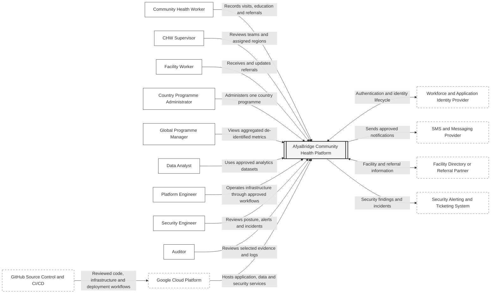
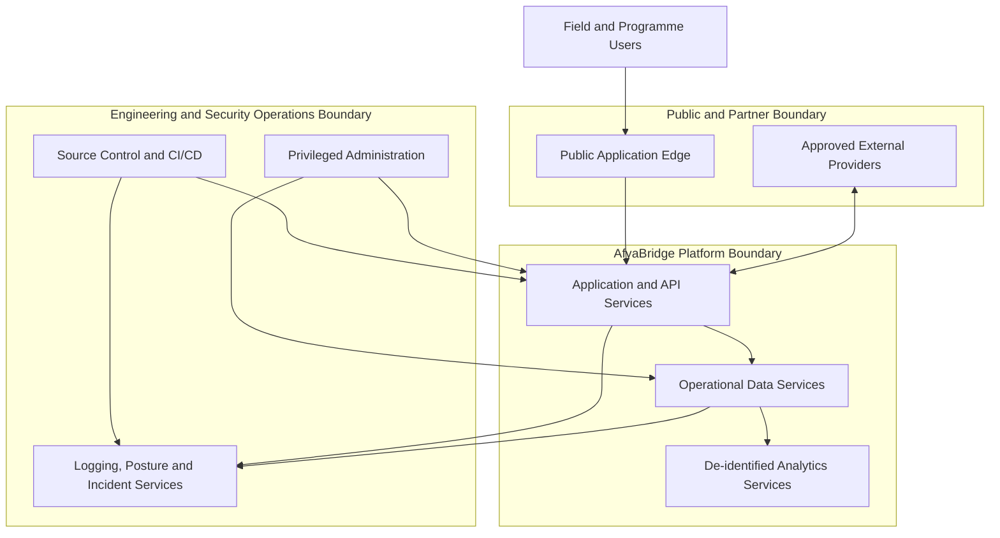

# System Context Diagram

## 1. Purpose

This diagram shows the people and external systems that interact with the fictional AfyaBridge community-health platform. It deliberately avoids implementation details such as Cloud Run, GKE, databases, subnets, or specific Google Cloud projects.

The goal is to establish the business context and the highest-level trust relationships before creating detailed container, deployment, network, and data-flow diagrams.

## 2. System context

## 3. Primary actors

| Actor | Primary interaction | Security concern |
|---|---|---|
| Community Health Worker | Records visits and referrals | Device loss, account compromise, geographic overreach |
| CHW Supervisor | Reviews assigned teams | Excessive regional access |
| Facility Worker | Processes referrals | Exposure of unnecessary household data |
| Country Programme Administrator | Manages one country | Cross-country privilege escalation |
| Global Programme Manager | Reviews global metrics | Re-identification of aggregated data |
| Data Analyst | Queries approved datasets | Direct access to restricted operational data |
| Platform Engineer | Operates cloud services | Persistent privilege and change-control bypass |
| Security Engineer | Investigates findings | Excessive investigative access and evidence handling |
| Auditor | Reviews evidence | Unnecessary access to operational systems |

## 4. External systems

| External system | Purpose | Boundary consideration |
|---|---|---|
| Identity provider | Authenticates staff, partners, and application users | Federation, MFA, session lifecycle, claims integrity |
| SMS and messaging provider | Sends reminders and referral notifications | Data minimisation, provider credentials, delivery logs |
| Facility directory or referral partner | Shares approved facility and referral information | API trust, validation, availability, data-sharing rules |
| Security alerting and ticketing | Receives findings and incident records | Sensitive evidence, access control, retention |
| GitHub | Stores source and runs CI/CD | Supply-chain risk, branch protection, OIDC trust |
| Google Cloud | Hosts platform resources | IAM, network, posture, encryption, regional availability |

## 5. Highest-level trust boundaries

The detailed threat model will analyse each boundary independently.

## 6. Security assumptions represented by the diagram

1. Public users never connect directly to operational databases.
2. External providers communicate only through approved interfaces.
3. Analytics consumers use de-identified datasets rather than operational stores.
4. Production deployment originates from reviewed CI/CD workflows.
5. Privileged administration is separate from ordinary application use.
6. Logging and security monitoring receive events from both application and cloud layers.
7. Country isolation exists inside the platform even though it is not expanded in this context-level view.
8. Google Cloud is a hosting and control plane, not an implicit trust guarantee.

## 7. Follow-on diagrams

This context diagram will later be expanded into:

- application container diagram;
- Google Cloud resource hierarchy diagram;
- workforce, workload, and application identity diagram;
- secure network zoning diagram;
- country and environment isolation diagram;
- CI/CD and software supply-chain diagram;
- logging, posture, and incident-response diagram;
- data-flow and trust-boundary diagrams;
- multi-region deployment and failover diagram.
